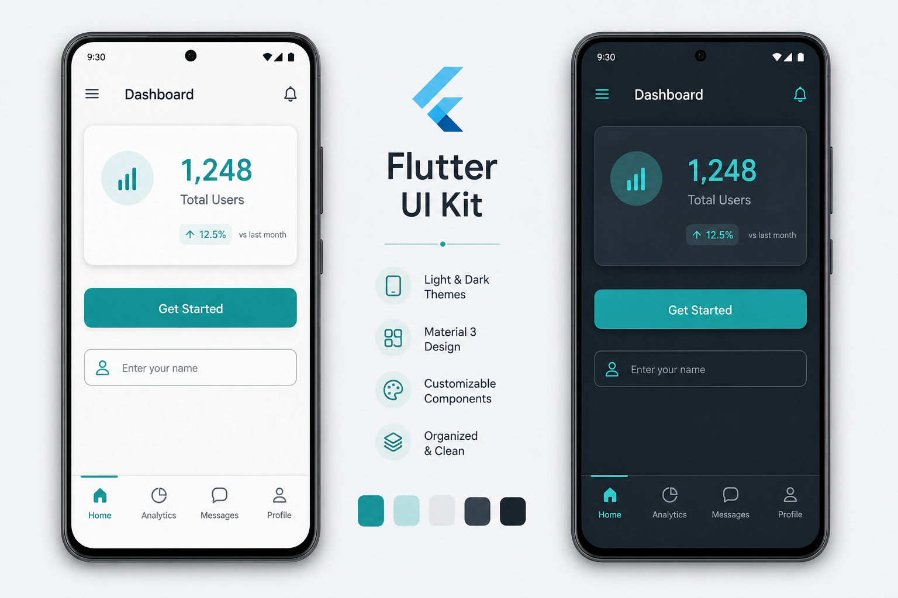
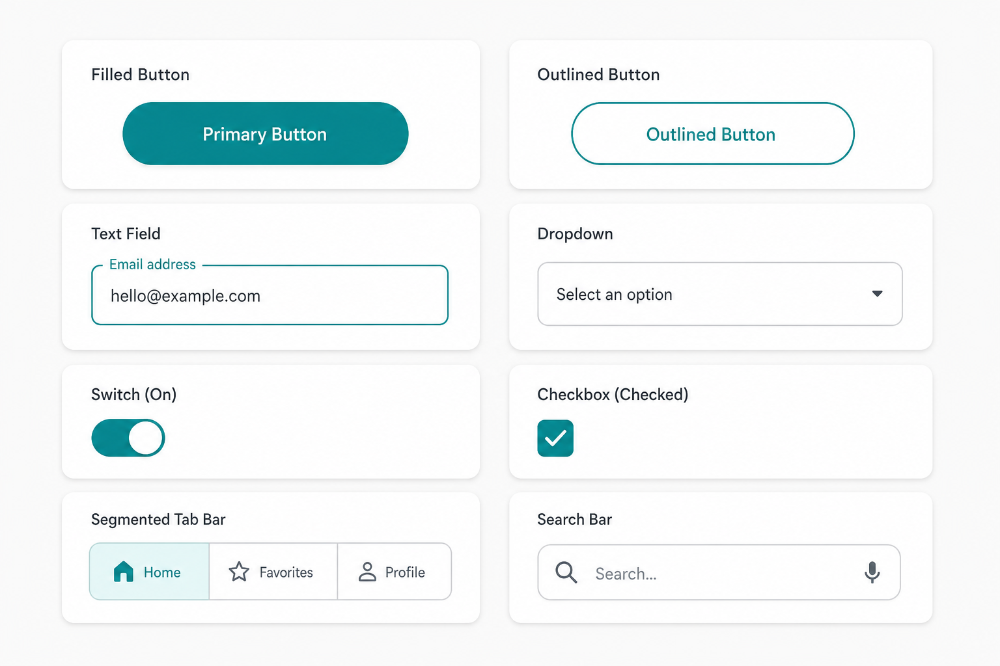
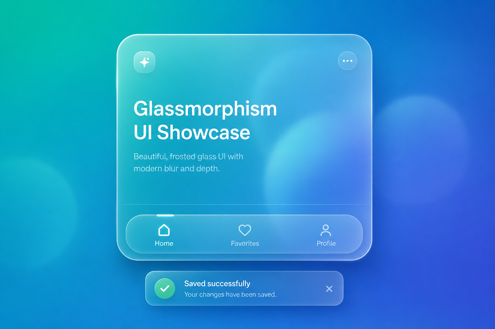

# Flutter UI Kit

A feature-rich Flutter UI kit built to speed up app development with Material 3 theming, reusable widgets, shimmer loaders, SVG icons, unified image handling, navigation helpers, responsive layout utilities, glass surfaces, product tours, and full light/dark theme support. All public APIs are exported through `package:vvk_ui_kit/vvk_ui_kit.dart`.

See [doc/IMPLEMENTATION_GUIDE.md](doc/IMPLEMENTATION_GUIDE.md) for integration patterns, composition conventions, and migration notes.

## Preview

| Theming (light & dark) | Components | Glass surfaces |
| :---: | :---: | :---: |
|  |  |  |

## Features

- **Theming** — `UIAppTheme` with semantic color tokens (`UIThemePalette`, `UIThemeExtension`, `UIMetrics`) and built-in light/dark presets (teal, zinc, slate, stone). Includes easy-to-use typography and shadow presets.
- **Animation** — `UIAnimateWrapper` for entry animations, `UITapGuard` for debouncing taps, `UIAvatarGlow`, `AnimatedGestureDetector`, and staggered entrance animations for lists and grids.
- **Buttons** — `UIStyledButton` with variants, plus primary/elevated/icon/image buttons, `UIGradientButton`, `UISliderButton`, `UISplitButton`, `UIGlassButton`, and `UISocialAuthButton`.
- **Accordion, cards & clips** — expansion accordions, `UICard`, `UIAnimatedFlipCard`, `UIHexagon`, `UISharpCorners`, `UITicketClip`, `UICouponClip`, `UICouponCard`.
- **Carousel** — `UICarouselWithIndicator`, `UISectionCarousel`, `UICarouselControls`, nav buttons, and page indicators.
- **Decoration & glass** — gradient widgets, dotted borders, corner ribbons, and frosted `UIGlassSurface` / `UIGlassCard` / `UIGlassScaffold` family with smart performance auto-fallback.
- **Display & rating** — stat cards, banners, progress bars, `UICommandBar`, `UIAnimatedCounter`, `UITextAvatar`, `UIStackBadge`, `UITimerBuilder`, `UIBatteryIndicator`, and `UIRatingBar`.
- **Dialogs** — shell dialogs, adaptive alert/action sheets, Cupertino sheets, image picker, and bottom sheets.
- **Feedback** — snackbars, badges, empty states, tooltips, `UIPopover`, `UISkeletonList`, and guided `UITourController` with spotlight overlay.
- **Forms & inputs** — `UIForm` with auto-focus error tracking, form fields, dropdowns, searchable hierarchy dropdowns, `UISearchBar`, `UITagInput`, `UINumberField`, `UIColorPicker`, OTP, sliders, calendar/date/time pickers, and settings tiles.
- **Layout & responsive** — dividers, separated rows/columns, `UIPageScaffold`, `UIExpandableFloatingPanel`, `UIDynamicOverflow`, keyboard dismiss area, `UIPortal` for overlays, and `Responsive` helpers.
- **Lists** — `UISwipeActionTile` with custom drag actions.
- **Loading** — shimmer containers, overlays, page loading, and load-more helpers.
- **Media** — `UIImage` for assets, network, SVG, and base64 via `UIImageScope`. Includes image preview frames.
- **Navigation** — app bars, side menu, bottom bars (`UIBottomNavyBar`, `UIFloatingBottomBar`, `UIGlassBottomNavBar`), `UIMenuBar`, `UITreeView`, settings scaffolds, breadcrumbs, and double-back-to-exit.
- **Selection & states** — list tile select, pill switch, rounded checkbox, radio groups, error states.
- **Tabs** — `UITabBar`, `UISegmentedTabBar`, `UIButtonsTab`.
- **Text & icons** — `UIText`, rich/read-more/marquee text, SVG rendering, social auth icons, and text row helpers.
- **Utilities** — `UIOverlayUtil`, `NavigationUtil`, `DialogUtil`, `DateTimeUtil`, `JsonUtils`, `JsonHelper`, `Mapper`, `Translations`, `TranslationCache`, and Dart extensions.

## Getting started

### Example app

Browse every widget and utility in the interactive catalog:

```bash
cd example
flutter run
```

Showcase sections: Core utilities, Buttons, Animation, Accordion/cards/clips, Carousel, Decoration, Display, Rating, Dialogs, Feedback, Inputs, Layout & responsive, Loading, Media, Navigation, Selection & states, Tabs, and Text & icons.

### Installation

```yaml
dependencies:
  vvk_ui_kit: latest
```

### Theme setup

```dart
import 'package:vvk_ui_kit/vvk_ui_kit.dart';

MaterialApp(
  theme: UIAppTheme.light,
  darkTheme: UIAppTheme.dark,
  themeMode: ThemeMode.system,
  home: const HomeScreen(),
)
```

Use `UIAppTheme.custom` when you need a custom `UIThemeColors` palette while keeping kit component styling.

#### Seed a theme from one color

Generate a full Material 3 palette from a single brand color:

```dart
MaterialApp(
  theme: UIAppTheme.fromSeed(const Color(0xFF6750A4)),
  darkTheme: UIAppTheme.fromSeed(
    const Color(0xFF6750A4),
    brightness: Brightness.dark,
  ),
)
```

#### High-contrast accessibility themes

Honor the OS "increase contrast" setting with the built-in high-contrast presets:

```dart
final highContrast = MediaQuery.of(context).highContrast;
MaterialApp(
  theme: highContrast ? UIAppTheme.highContrast(Brightness.light) : UIAppTheme.light,
  darkTheme: highContrast ? UIAppTheme.highContrast(Brightness.dark) : UIAppTheme.dark,
)
```

### Image scope (optional)

Wrap your app with `UIImageScope` for custom network/SVG builders (`cached_network_image`, `flutter_svg`, etc.). Without it, `UIImage` uses Flutter's built-in network loader and the kit's lightweight `UISvgImage` renderer.

## Usage examples

### Buttons

```dart
UIStyledButton(
  style: UIStyledButtonStyle.primary(context),
  onPressed: () {},
  child: const Text('Get Started'),
)

UISplitButton.fromTheme(
  context,
  label: 'Save',
  onPressed: save,
  menuItems: [UISplitButtonMenuItem(label: 'Discard', onTap: discard)],
)
```

### Glass surfaces

```dart
UIGlassCard.fromTheme(
  context,
  child: const Padding(
    padding: EdgeInsets.all(16),
    child: Text('Frosted card'),
  ),
)

UIGlassScaffold(
  appBar: UIGlassAppBar(title: const Text('Glassy App')),
  body: Center(child: UIImage('...')),
)
```

### Animation & Feedback

```dart
UITapGuard(
  onTap: () => print('Throttled tap'),
  child: UIStyledButton(
    style: UIStyledButtonStyle.primary(context),
    onPressed: () {},
    child: const Text('Click Me'),
  ),
)

UIAvatarGlow(
  child: const CircleAvatar(child: Icon(Icons.person)),
)
```

### Product tour

```dart
final tour = UITourController(
  steps: [
    UITourStep(
      targetKey: _fabKey,
      title: 'Quick actions',
      description: 'Tap here to create a new item.',
    ),
  ],
);
```

### Forms

```dart
UIForm(
  child: Column(
    children: [
      UIFormTextField(name: 'email', label: 'Email'),
      UISearchBar.fromTheme(context, hintText: 'Search…', onChanged: filter),
      UIFormCheckboxField(name: 'terms', label: 'Accept terms'),
    ],
  ),
)
```

### Navigation

```dart
NavigationUtil.pushPage(context, const ProfileScreen());
```

## Testing

The package includes a comprehensive widget test suite. Run all tests from the package root:

```bash
flutter test
```

Tests are organized under `test/` by category — buttons, inputs, dialogs, feedback, glass, navigation, loading, media, and more — mirroring the public widget groups in `lib/vvk_ui_kit.dart`. As of 1.1.0, the suite covers **326 tests** across **32 test files**.

## Component overview

| Category | Key components |
| :--- | :--- |
| **Theming** | `UIAppTheme`, `UIThemePalette`, `UIThemeExtension`, `UIMetrics`, `UITypography` |
| **Animation** | `UIAnimateWrapper`, `UITapGuard`, `UIAvatarGlow`, `AnimatedGestureDetector`, `UIEntranceAnimation` |
| **Buttons** | `UIStyledButton`, `UISplitButton`, `UIGlassButton`, `UISocialAuthButton`, `UISliderButton` |
| **Cards & clips** | `UICard`, `UIAnimatedFlipCard`, `UICouponCard`, `UITicketClip`, `UIHexagon` |
| **Glass** | `UIGlassSurface`, `UIGlassCard`, `UIGlassScaffold`, `UIGlassAppBar`, `UIGlassBottomNavBar` |
| **Display & rating** | `UICommandBar`, `UIAnimatedCounter`, `UIRatingBar`, `UITextAvatar`, `UIBatteryIndicator` |
| **Feedback** | `UITourController`, `UIPopover`, `UIBadge`, `UISkeletonPlaceholder`, `UISkeletonList`, `UISnackbar` |
| **Dialogs** | `showUIAdaptiveAlertDialog`, `showUIAdaptiveActionSheet`, `showUISheet`, `UIShellDialog` |
| **Inputs** | `UISearchBar`, `UITagInput`, `UINumberField`, `UIColorPicker`, `UIForm`, `UIInputOTP` |
| **Layout** | `UIPageScaffold`, `UISeparatedRow`, `UIExpandableFloatingPanel`, `UIPortal`, `UIDynamicOverflow` |
| **Navigation** | `UIBottomNavyBar`, `UIMenuBar`, `UITreeView`, `UIDoubleBackToExit`, `UIFloatingBottomBar` |
| **Media** | `UIImage`, `UIImageScope`, `UIImagePreviewFrame`, `UISvgImage` |
| **Lists** | `UISwipeActionTile` |
| **Utilities** | `UIOverlayUtil`, `NavigationUtil`, `JsonUtils`, `JsonHelper`, `Mapper`, `Translations`, `DateTimeUtil` |

## Public API

All public symbols are exported from `package:vvk_ui_kit/vvk_ui_kit.dart`. Internal helpers under `lib/src/` are not part of the stable API.

### Modular imports

The full barrel (`vvk_ui_kit.dart`) re-exports every widget, so a file that only
needs theming still pulls the whole surface into analysis. In larger apps,
prefer the focused entry points below — e.g. `theme.dart`, `widgets.dart`
(carousel/display/cards), `media.dart`, and `navigation.dart` — to keep imports
tight and help incremental compile times. Import only what you need:

| Entry point | Contents |
|-------------|----------|
| `package:vvk_ui_kit/vvk_ui_kit.dart` | Full barrel (default) |
| `package:vvk_ui_kit/theme.dart` | `UIAppTheme`, palettes, typography, shadows |
| `package:vvk_ui_kit/buttons.dart` | Button family + `UIGlassButton` |
| `package:vvk_ui_kit/inputs.dart` | Forms, fields, pickers, selection inputs |
| `package:vvk_ui_kit/layout.dart` | Scaffolds, dividers, responsive, spacing |
| `package:vvk_ui_kit/dialogs.dart` | Dialogs, sheets, adaptive alerts |
| `package:vvk_ui_kit/feedback.dart` | Snackbars, badges, tours, loading/shimmer |
| `package:vvk_ui_kit/navigation.dart` | App bars, bottom bars, tabs, menus |
| `package:vvk_ui_kit/media.dart` | `UIImage`, SVG icons, image scope |
| `package:vvk_ui_kit/widgets.dart` | Cards, carousel, display, glass, text, rating |
| `package:vvk_ui_kit/core.dart` | Extensions, JSON/navigation/translation utils |

See [doc/IMPLEMENTATION_GUIDE.md](doc/IMPLEMENTATION_GUIDE.md) for detailed integration guidance and [doc/MIGRATION.md](doc/MIGRATION.md) for upgrade notes.

## Support

If this package helps you ship faster, consider supporting its development:

<a href="https://buymeacoffee.com/vvk27" target="_blank">☕ Buy Me a Coffee</a>

## License

This project is licensed under the MIT License — see the [LICENSE](LICENSE) file for details.
